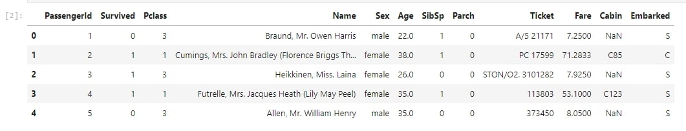
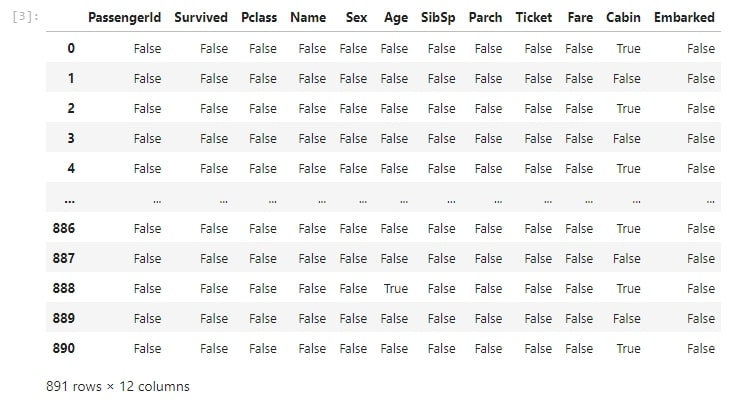
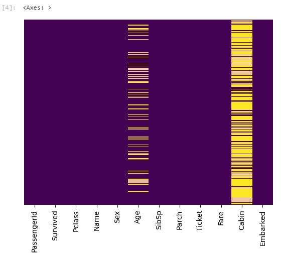
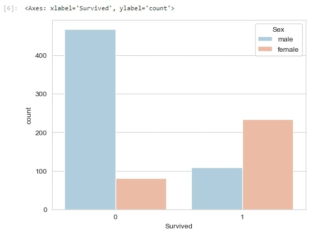
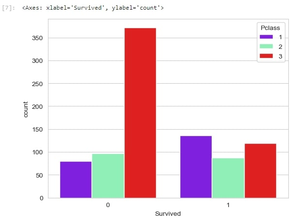
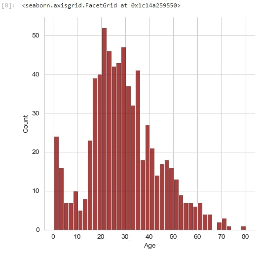
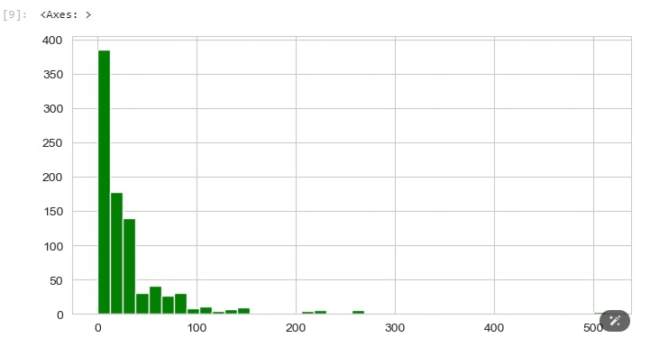
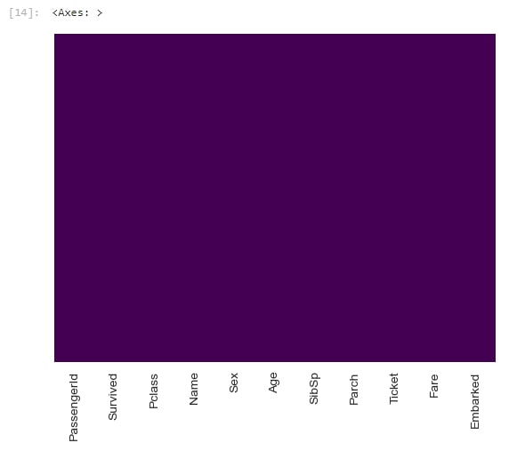
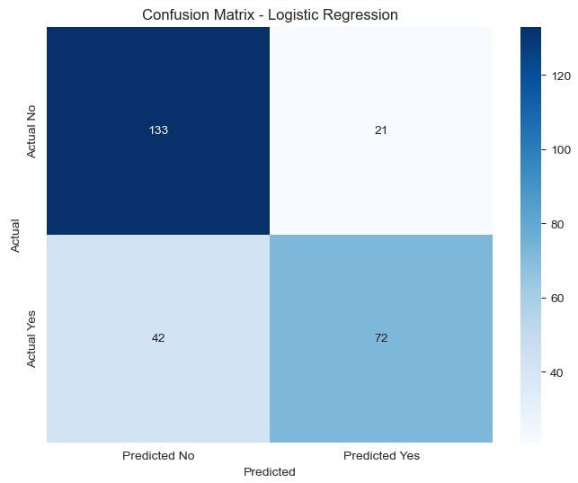
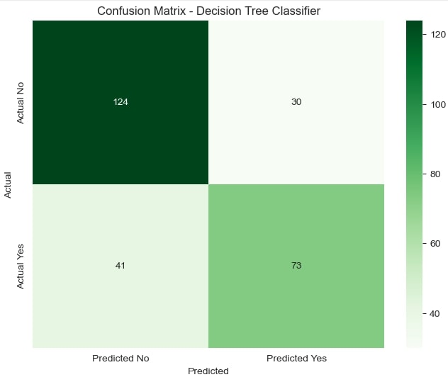

# Titanic Dataset - Exploratory Data Analysis (EDA)

## Overview
This repository contains an exploratory data analysis (EDA) on the Titanic dataset from Kaggle. 
The aim of this project was to clean the dataset, explore relationships between variables, identify patterns and trends, and evaluate predictive models.

## Dataset
The dataset used is the train Titanic dataset, which contains information about the passengers aboard the Titanic, including their age, gender, ticket class, fare, and whether they survived or not.

## Analysis Steps

1. Data Import and Inspection

- Loaded the dataset and inspected the first few rows to understand its structure.
- Checked for missing values and data types.

## First few rows of the dataset

## Summary of missing values

2. Data Visualization

- Visualized the distribution of survivors and explored patterns based on gender, class, and age.
- Created various plots to illustrate the relationships between variables using seaborn and matplotlib.

## Heatmap showing missing data 

## Countplot for survivors by gender

## Countplot for survivors by class

## Age distribution histogram

## Fare distribution histogram

3. Data Cleaning and Preprocessing

- Imputed missing values, particularly ages based on passenger class.
- Dropped columns with too many missing values (e.g., Cabin).
- Converted categorical variables into dummy variables for model training.

## Cleaned dataset heatmap  

4. Model Training

- Built and evaluated two models: Logistic Regression and Decision Tree Classifier.
- Split the data into training and testing sets, trained the models, and evaluated their accuracy.
- Displayed confusion matrices and accuracy scores for both models.

## Confusion Matrix (Logistic regression) 

## Confusion Matrix (Decision tree classifier) 

## Libraries Used
- pandas
- numpy
- matplotlib
- seaborn
- scikit-learn

## Results
- The Logistic Regression model achieved an accuracy of 76.49%.
- The Decision Tree Classifier model achieved an accuracy of 74.63%.
These results indicate that while the models perform moderately well, further improvements could be made through hyperparameter tuning and feature engineering.

## Conclusion
This project provided valuable insights into the Titanic dataset and showcased basic steps in exploratory data analysis, data cleaning, and model evaluation. 
